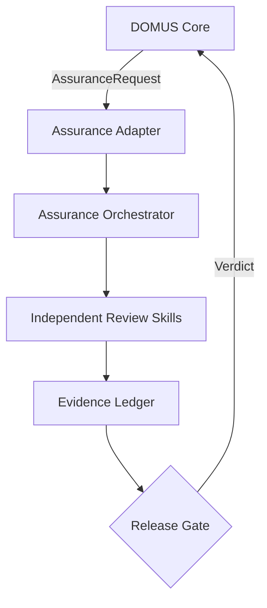

# Arquitectura de DOMUS Assurance Adapter

## Responsabilidad

DOMUS Assurance valida que una implementación candidata satisfaga la intención funcional, los contratos y los journeys acordados. No reemplaza las pruebas automatizadas ni modifica código por iniciativa propia. Sus resultados alimentan un gate humano o automatizado de liberación.

## Separación del proceso principal

El `DOMUS Core Orchestrator` conserva discovery, PRD, DDD, ADD, ADR, readiness y handoff. Al terminar una implementación, publica un `AssuranceRequest` al puerto del adaptador. `Assurance Orchestrator` crea su propio `run_id`, snapshot, presupuesto, contexto y ledger. Solo devuelve el veredicto final; no comparte estado mutable con el proceso creador.



## Puertos

- `AssuranceIngressPort`: inicia, consulta, cancela o reanuda una ejecución.
- `ArtifactSnapshotPort`: obtiene artefactos inmutables por digest.
- `SurfaceDriverPort`: opera web, escritorio, móvil, CLI, TUI o API mediante adaptadores concretos.
- `EvidenceStorePort`: conserva evidencias, lineage, timestamps y hashes.
- `PolicyPort`: suministra umbrales, riesgos, permisos y reglas de aprobación.
- `VerdictEgressPort`: entrega el resultado al core, CI/CD, TUI o UI.

## Contrato de entrada

`AssuranceRequest` debe incluir:

```yaml
schema_version: domus.assurance.request/v1
request_id: string
project_id: string
candidate:
  version: string
  source_revision: string
  environment: string
artifact_snapshot:
  prd: { uri: string, digest: string }
  domain: { uri: string, digest: string }
  architecture: { uri: string, digest: string }
  decisions: { uri: string, digest: string }
  specification: { uri: string, digest: string }
surfaces:
  - kind: web|desktop|mobile|api|cli|tui
    entrypoint: string
test_results: []
risk_policy: { profile: string }
authorization: { allowed_actions: [], forbidden_actions: [] }
```

Si faltan intención, criterios verificables, una superficie accesible o autorización necesaria, el proceso devuelve `NEEDS_INPUT`; no inventa un oráculo.

## Contrato de salida

```yaml
schema_version: domus.assurance.verdict/v1
run_id: string
candidate_revision: string
verdict: PASS|PASS_WITH_RISK|FAIL|NEEDS_INPUT|INCONCLUSIVE
coverage:
  requirements: { verified: 0, total: 0 }
  journeys: { executed: 0, total: 0 }
findings: []
residual_risks: []
unknowns: []
evidence_index: []
approvals_required: []
```

## Orquestación

1. `derive-acceptance-contract` normaliza intención, criterios, invariantes y oráculos.
2. El orquestador construye un plan basado en riesgo y selecciona adaptadores de superficie.
3. `simulate-user-journeys`, `explore-functional-risks` y `verify-cross-layer-contracts` pueden ejecutarse independientemente.
4. `audit-assurance-evidence` comprueba procedencia, reproducibilidad y cobertura.
5. `decide-release-readiness` aplica la política sin alterar hallazgos.
6. El orquestador publica el veredicto y cierra el ledger.

## Estados

`RECEIVED → CONTRACT_READY → PLANNED → EXECUTING → EVIDENCE_REVIEW → VERDICT_PENDING → COMPLETED`.

Estados de pausa: `NEEDS_INPUT`, `APPROVAL_REQUIRED`, `ADAPTER_UNAVAILABLE`. Estado terminal adicional: `CANCELLED`.

## Invariantes

- El snapshot y la revisión candidata quedan fijados al iniciar.
- Ningún hallazgo se considera verificado sin evidencia direccionable.
- Un revisor no recibe chain-of-thought, justificaciones privadas ni memoria episódica del implementador.
- Las acciones destructivas o productivas requieren autorización explícita.
- `PASS` exige cobertura de todos los criterios críticos y cero defectos bloqueantes abiertos.
- La ausencia de evidencia nunca se interpreta como aprobación.
- Las correcciones generan otra revisión candidata y otro run; no mutan el run cerrado.

