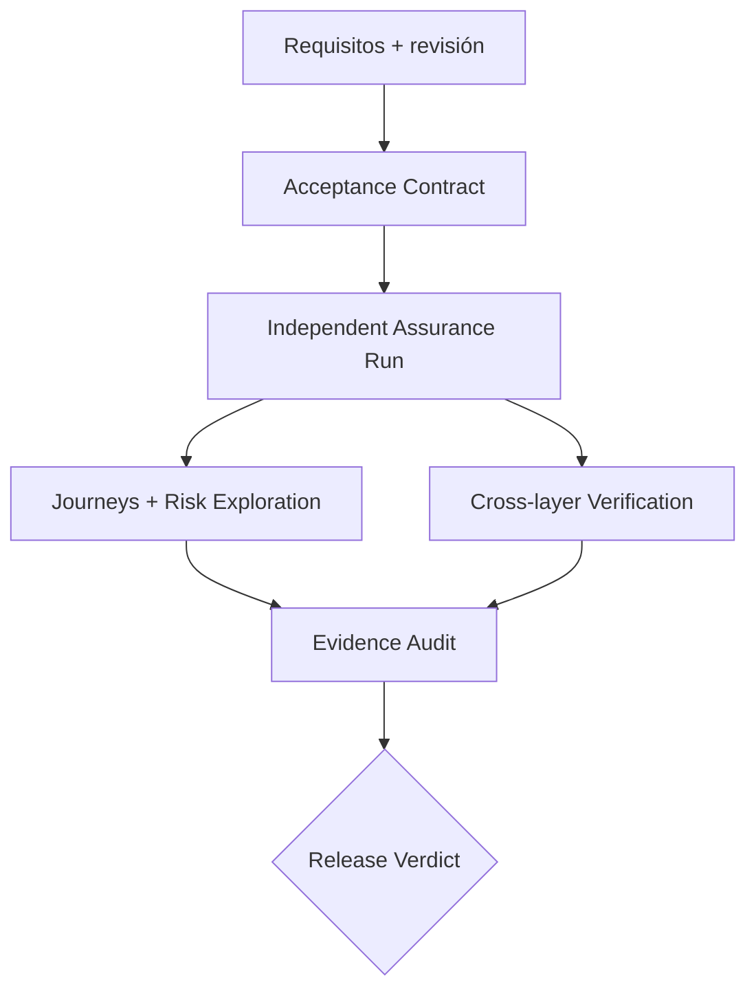

# DOMUS Assurance Adapter

Framework open source de QA funcional asistido por agentes para validar software más allá de los tests automatizados. Funciona con DOMUS AI o de forma completamente independiente desde Codex, Claude Code, OpenCode u otro runtime capaz de cargar instrucciones tipo `SKILL.md` y operar la aplicación bajo prueba.

> Estado: especificación ejecutable y paquete de skills v1.0.0. No incluye navegador, driver móvil ni proveedor de modelos; se integra con las herramientas disponibles en el runtime elegido.

## Problema que resuelve

En un proyecto one-person, el mismo agente o desarrollador suele definir, implementar y aprobar. Los tests verifican casos previstos, pero no garantizan que la funcionalidad cumpla la intención ni que la evidencia corresponda a la revisión liberada.

Este framework separa construcción y validación:

- fija requisitos, revisión candidata y política de riesgo;
- abre un contexto de revisión independiente;
- deriva un contrato de aceptación;
- ejecuta journeys y exploración basada en riesgos;
- revisa contratos entre capas;
- audita la evidencia;
- emite un veredicto trazable.



## Inicio rápido sin DOMUS AI

### 1. Instalar las skills

```bash
mkdir -p ~/.codex/skills
cp -R skills/* ~/.codex/skills/
```

También puedes instalarlas en el directorio de skills del proyecto. Recarga el runtime para descubrirlas.

### 2. Preparar la entrada

No necesitas artefactos DOMUS. Proporciona una historia, ticket o PRD; SHA o build exacto; entorno seguro; restricciones; tests y contratos relevantes. Consulta [el ejemplo](examples/standalone-request.yaml).

### 3. Ejecutar

```text
Usa $domus-assurance-orchestrate para revisar independientemente el commit
8f31c2a del flujo "recuperar contraseña".

Fuentes: docs/user-story.md, openapi.yaml y ADR-014.
Entorno: staging. No uses producción ni envíes correos reales.
Usa examples/risk-policy.yaml.

Devuelve cobertura, hallazgos reproducibles, evidencias, riesgos residuales
y un veredicto.
```

### 4. Interpretar

- `PASS`: críticos cubiertos y sin bloqueantes.
- `PASS_WITH_RISK`: mínimos cumplidos; requiere aceptar riesgos explícitos.
- `FAIL`: incumplimiento confirmado.
- `NEEDS_INPUT`: falta intención, acceso o una decisión.
- `INCONCLUSIVE`: la evidencia no permite concluir.

## Skills

| Skill | Uso |
| --- | --- |
| `domus-assurance-orchestrate` | Orquestación integral |
| `domus-derive-acceptance-contract` | Requisitos → criterios |
| `domus-simulate-user-journeys` | Recorridos de usuario |
| `domus-explore-functional-risks` | Casos límite |
| `domus-verify-cross-layer-contracts` | UI/API/dominio/datos/eventos |
| `domus-audit-assurance-evidence` | Calidad de evidencia |
| `domus-decide-release-readiness` | Veredicto por política |

## Documentación

- [Uso autónomo](docs/STANDALONE_USAGE.md)
- [Integraciones](docs/INTEGRATIONS.md)
- [Arquitectura](ARCHITECTURE.md)
- [Uso con DOMUS AI](USAGE.md)
- [Seguridad](SECURITY.md)

## Principios

El implementador no aprueba su propio trabajo. La revisión se fija por SHA o digest. La ausencia de evidencia no equivale a aprobación. Los tests son evidencia, no el único oráculo. Producción y acciones destructivas están denegadas por defecto.

## Licencia

Apache License 2.0. Consulta [LICENSE](LICENSE).

